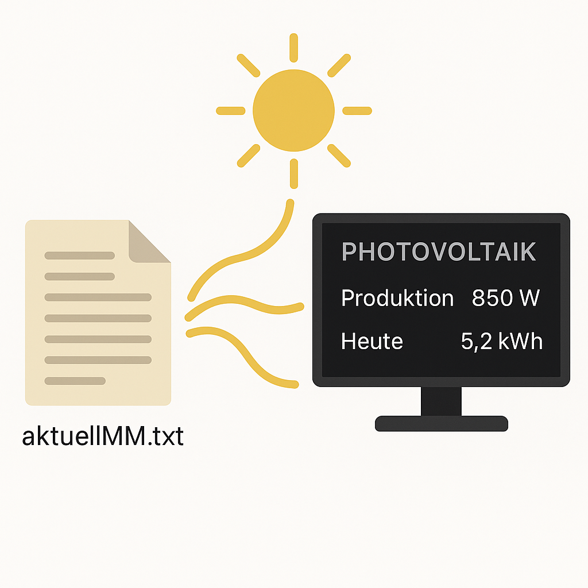

# MMM-Photovoltaik

Basic template how to open a local textfile, extract data and display on screen. In this case it was used for the cyclically replaced file MMaktuell.txt coming via FTP from my photovoltaik inverter containing actual data.


## 🧩 Functions

- open local TXT file and read into array
- all data in text file is separated by semikolon
- all data from array are copied into several variables
- those variables are put to screen on magic mirror

## 📸 Screenshot




## 🛠️ Installation

```bash
cd ~/MagicMirror/modules
git clone https://github.com/ASteinsdoerfer/MMM-Photovoltaik.git
cd MMM-Photovoltaik
npm install

## 🔧 configuration
Change in config.js

{
  module: "MMM-MMM-Photovoltaik",
  position: "middle_center"
 },


## 🙌 Author
ASteinsdoerfer
